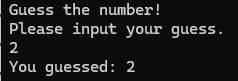

  

# Guessing-Game
🚀 Memory safe, blazing fast, minimal **Guessuing Game** written in the rust(🚀) programming language 🚀

# How to run the game?

## Building from source
1. Clone repo
2. Run ``cargo build``
3. Run ``cargo run``

# Troubleshooting
Make sure you have [Rust](https://www.rust-lang.org/tools/install) installed on your system

